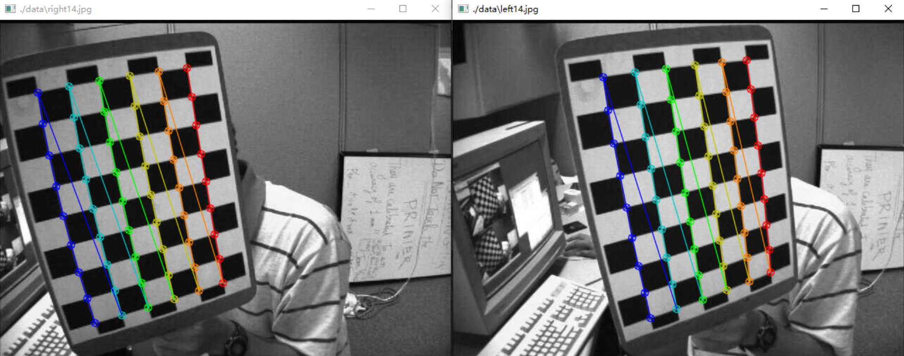
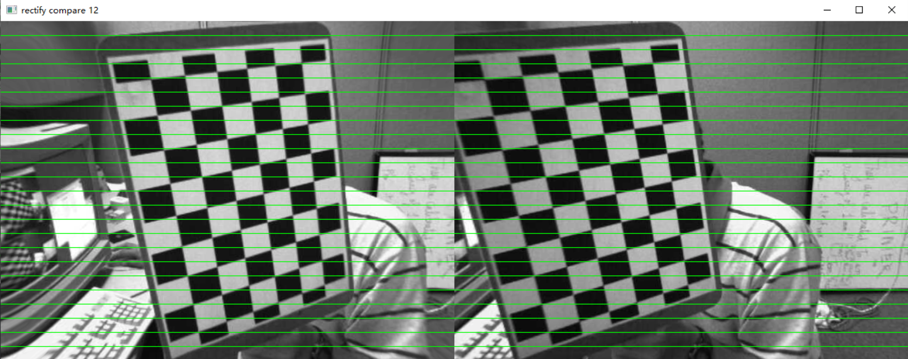

# Stereo-CaliRect-in-Python

Stereo calibration and rectification implemented with Python3.8 and OpenCV.

This is the pre-work to obtain depth image based on disparity

## Dependency:

OpenCV 4.5.5

numpy (together with OpenCV)

## Result:

note: 
- Remember to customize user config in the first few lines of the script
- if it doesn't work, try to verify the shape of corners
- images in data are from openCV repos: https://github.com/opencv/opencv/tree/4.x/samples/data

---
## References:
1. openCV sample: https://github.com/opencv/opencv/blob/a1143c4ea02afa7c45c2a1e86be431b81a83bcd1/samples/cpp/stereo_calib.cpp
2. openCV-3D documentation: https://docs.opencv.org/4.x/d9/d0c/group__calib3d.html
3. *A Flexible New Technique for Camera Calibration* https://www.microsoft.com/en-us/research/wp-content/uploads/2016/02/tr98-71.pdf